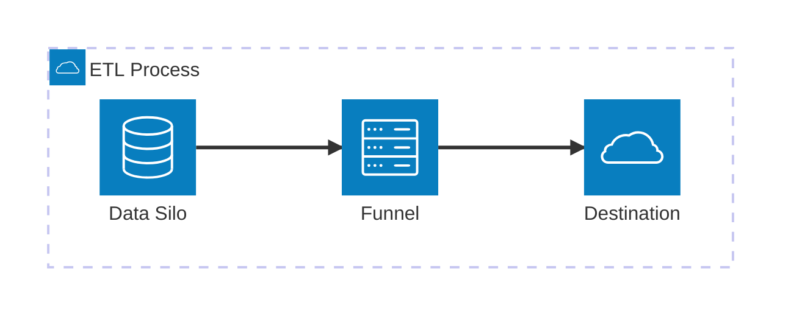
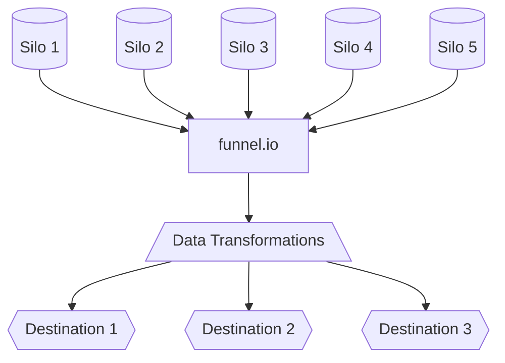
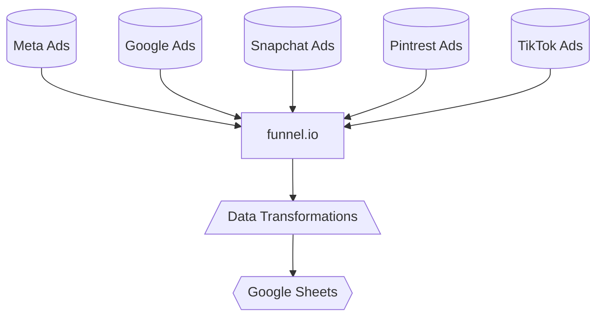

# Data - Situational Analysis

Assigned too: Ky 
Client: Ted Baker
Created time: December 10, 2024 9:49 AM
Update Type: Data Quality

Elevar is reporting 101% data accuracy for some platforms:

US ad account is showing 55% data accuracy. 

Channel summary for the last 24 hours shows inconsistencies with meta over reporting. 

We still are waiting for elevar to complete the setup. They have confirmed they **cannot** split info by markets as well as have one rollup property. 

Elevar support confirmed its not technically possible and they only provide a workaround. My concern (@Ky ) with this is continued support and ongoing updates and changes on their end may destroy this setup which would be a concern. 

Currently exploring Funnel as a reporting tool for Ted Baker. Goal is pushing data into a spreadsheet as a way to track data. 

We can use Funnel as a ETL tool to extract data from platforms, apply transformations so it’s unified for reporting and load it into a destination. 

Tech stack would looks like:

Our data silos will feed data into [Funnel.io](http://Funnel.io), acting as our warehouse and single point for reporting. 

Any filtering and transformations (i.e currency, funnel stage, combined metrics, formulas) will be handled within funnel. 

Once Transformed, the data is free to flow into any destination we desire. 

