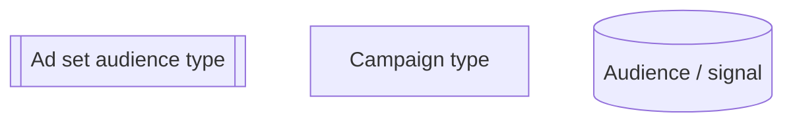
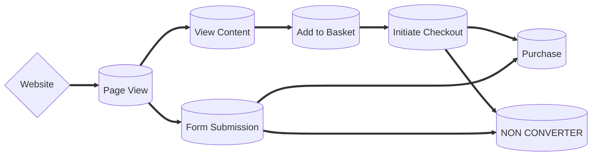
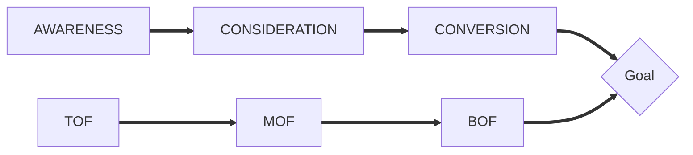
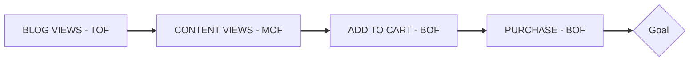
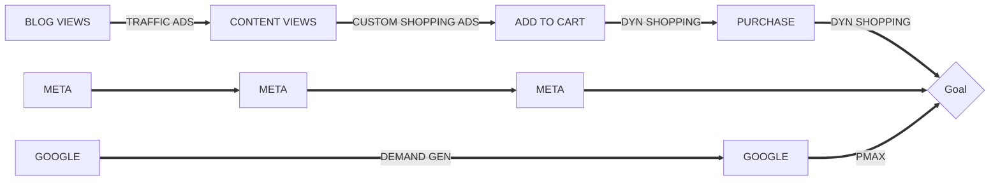
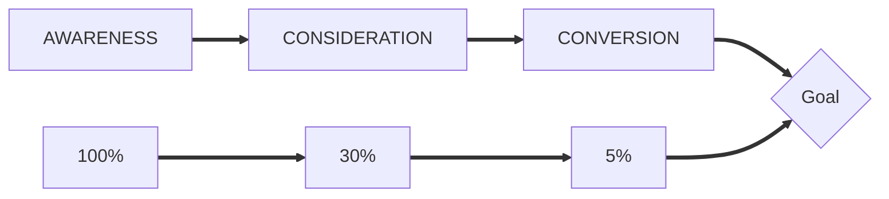
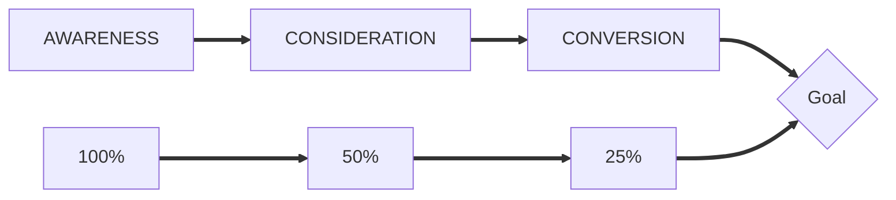

# Ark Wildlife - account restructure

Owner: Ky

# User journey mapping

## Proposed Setup

## Channel Splits

# Paid media structure

## BLOG VIEWS

### OBJECTIVE

Prospect new customers and educate them around Ark wildlife in a non sales way by bringing them to the website and increase the number of new and engaged sessions by interacting with blog content. 

Audiences will be LAL’s, detailed targeting, Geographical and insights from the client.

### KPI’s

- Engaged Blog Views*
- Google traffic*
- Sessions
- Bounce rate
- Impressions
- Video views
- Thumb stop rate*
- AVG session time

### CREATIVE

Focused on educational content, showing users benefits of ‘X’ or recommendations for ‘Y’

## CONTENT VIEWS

### OBJECTIVE

Once we have completed prospecting and managed to identify the most engaged users, we can retarget these users and show them products we think they may be most interested in. 

We’ll then be able to use this data to dynamically fulfil conversion driven activity.

### KPI’s

- Content Views
- Conversion value (optimisation metric)
- Session time (optimisation metric)
- Frequency (used for budget indication)
- Reach

### CREATIVE

Combination of curated assets and the product feed to share recommendations for products 

## ADD TO CART

### OBJECTIVE

Once we have accurate data on users that are viewing products, we can then start dynamically showing those products to users again if they have not already made a purchase. 

### KPI’s

- Add to cart
- Cart value
- CPA
- Session time
- Frequency (used for budget indication)
- Reach

### CREATIVE

Dynamic shopping ads based on content views. Ad sets split by product type

## PURCHASE

### OBJECTIVE

Following in the steps of ads optimised for Add to carts, we’ll be using this campaign to mop up any potential loose ends of basket abandonments.

these campaigns are designed to tell, not show as the user nears the end of their purchase journey.  

### KPI’s

- Purchases
- Purchase Value
- CPA
- Frequency (used for budget indication)
- Reach
    
    ### CREATIVE
    
    Dynamic shopping ads based on content views. Ad sets split by product type
    

**custom metrics*

### AOB

ROAS - This can be used from either a BOF perspective or if the overall goal is new customers, then we can report on this from an account level. Benchmarks would need to be set and we’d use this metric differently to how it’s been used previously to identify the most profitable audiences ect.

# Data Quality

By using data signals to dictate the audience sizes for our funnels requires our data to be clean and accurate. Solely being dependant on client side tagging means we’ll experience data losses that are key to enabling the core fundamentals of this strategy to work. there will be a natural drop off of users at each stage, by ensuring we use server side tracking will let us re engage with a higher portion of users regardless of the natural decay. 

