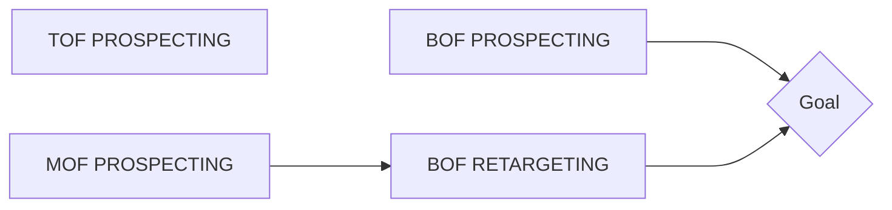
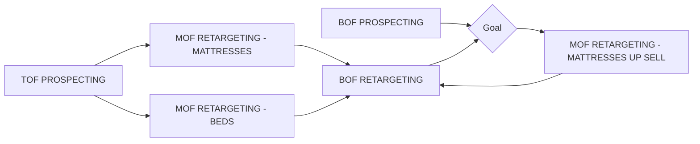

# Everest Beds - New user journey

Owner: Ky

Previous Journey

New approach

- TOF Prospecting now optimises for content views targeting a range of audiences from lookalikes and detailed targeting.
- BOF is a dynamic shopping campaign retargeting users based on the products they have viewed or added to basket but not brought to then dynamically share recommendations
- BOF retargeting will then retarget users that have added to the cart within the past 90 days.
- We have a new MOF retargeting ad set designed to up sell users that have purchased an bed in the last 14 days.

    ((Circle))
    (Round Rect)
    {Rhombus}