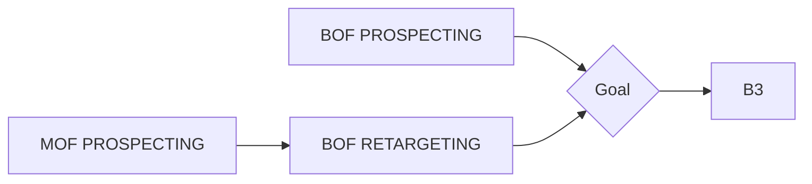
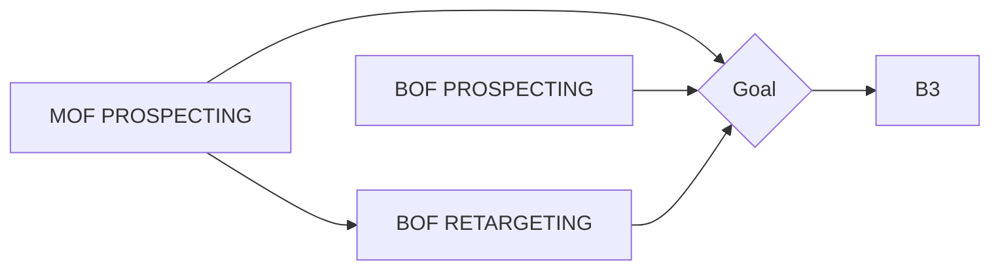
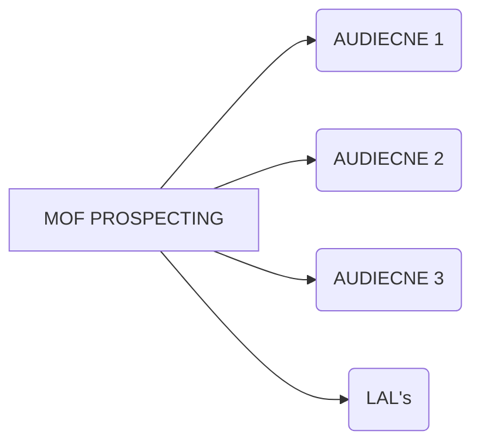

# FURNICOMP - New user journey

Owner: Ky

Previous Journey

- MOF was optimised for landing page views
- BOF RTG had a higher spend that MOF prospecting causing frequency to jump up.
- BOF Prospecting is taking all the conversions but give us little data to know who / how for optimising.

New approach

- TOF Prospecting now optimises for content views targeting a range of audiences from lookalikes and detailed targeting. campaign goal is set to conversions so we will see a section of users go straight to purchase which is okay, it’s mimicking the BOF prospecting but we more split our audiences creative ect.
- BOF ads should then be dynamic shopping campaigns retargeting users based on the products they have viewed or added to basket but not brought to then dynamically share recommendations.
- BOF retargeting will then retarget users that have added to the cart within the past 90 days.
- BOF prospecting has a reduced budget of £10/day to slowly faze it out.

Current MOF campaign structure used to prospect and test different audiences. 

Further iterations 

TOF not needed for this brand? Potential audiences is perceived to be price driven so brand work may not be suitable.