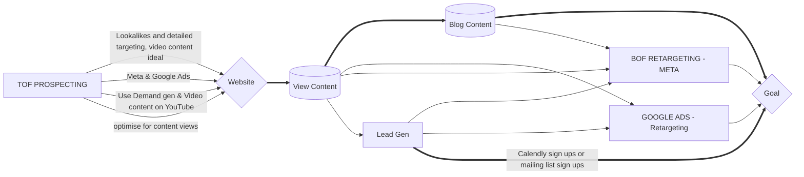

# Somerset grill - New user journey

Owner: Ky

https://www.somersetgrill.com/

New approach

- TOF Prospecting now optimises for content views targeting a range of audiences from lookalikes and detailed targeting.
- BOF retargeting - Dynamic shopping campaign retargeting users based on the products they have viewed or added to basket but not brought to then dynamically share recommendations
- Lead gen - push Calendly sign ups and / or mailing list subscriptions

    ((Circle))
    (Round Rect)
    {Rhombus}