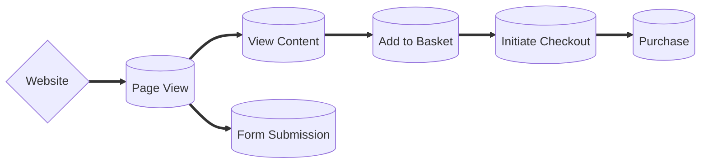
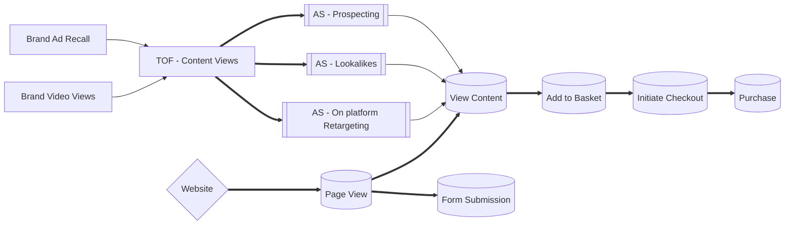
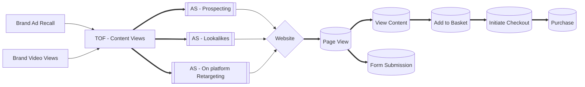
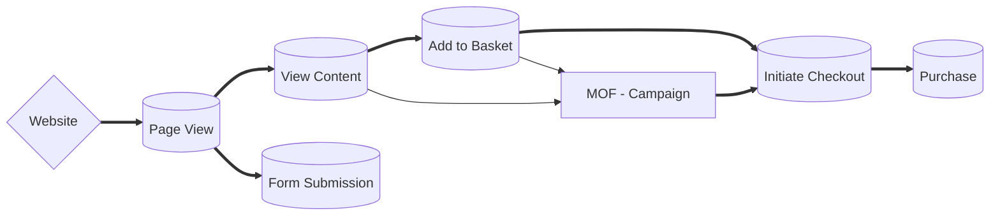
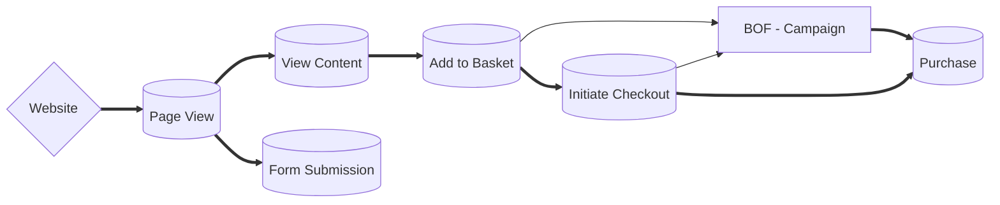

# Website Audiences // Signals

Owner: Ky 
Verification: Verified

# Overview

Currently we have the option to populate audiences that sit in any of these event based actions on all sites. If we think of the round objects as databases, we can fill them with users and retarget those databases.  Our ads then need to make sure they slot into one of these gaps, targeting that core audience ‘database’ or prospect.



## BLOG VIEWS

### OBJECTIVE

### KPI’s

- Engaged Blog Views*
- Google traffic*
- Sessions
- Bounce rate
- Impressions
- Video views
- Thumb stop rate*
- AVG session time

## CONTENT VIEWS

### OBJECTIVE

### KPI’s

- Content Views
- Session time
- Frequency
- Reach

## ADD TO CART

### OBJECTIVE

### KPI’s

- Add to cart
- Cart value
- CPA
- Session time
- Frequency
- Reach

## PURCHASE

### OBJECTIVE

### KPI’s

- Purchases
- Purchase Value
- CPA
- Frequency
- Reach

## TOF Activity

We should look to push any prospecting into the TOF category. Here is where we should test detailed targeting, demographic and geo targeting. 

Creative should be focused towards introducing the brand // lean more.

Awareness campaigns make there way into the mix if we want to maximise reach and impressions. We can then use Ad Recall to gain reach and video vies, and retargeting page engagement or video views to push users to the website via an TOF content views optimising campaign which. This let’s ensure the platform has a goal related to some sort of value and we can capture data related to the products demands.

It also let’s us populate those ‘databases’ ready to retarget users at a later date.





## MOF Activity

MOF activity can slot into the user journey somewhere between View Content and Initiate Checkout depending on the client / account.

Ensuring we’re present at another major process within the buying journey will help users through the consideration phase. 

Our creative should be focused around pushing users over the edge to purchase. This is where dynamic placements can make their appearance as either an ad or extensions.

By pushing users into the checkout, the site should in theory convert the user. If we see large drop offs at this point, the CRO might be an issue at this point. 



## BOF Activity

We should then look at BOF activity targeting users that have began a checkout and not purchased or users that have added to basket and not purchased. Depending on the client account. 

Similar to basket abandonment emails, we can position our BOF ads retargeting this portion of users in a similar way. 

Depending on how granular we want to get will dictate how targeted the message is. Messages like “forgot to checkout?” can come into play here. 

Dynamic creative should be heavily considered here. 



- **Other bits and bobs**
    
    ```mermaid
    graph LR
        A[TOF PROSPECTING] 
        B[MOF PROSPECTING] 
        C[BOF PROSPECTING] 
        D[BOF RETARGETING]
        E[GOOGLE ADS - Prospecting]
        E1[GOOGLE ADS - Retargeting]
    
    	  G{Goal}
    	  
    	  
    A & E--Directing prospects to the website -->W{Website}
    A1[(View Content)]
    
    W-->A1
    
    B--->D
    C--->G
    D--->G
    ```